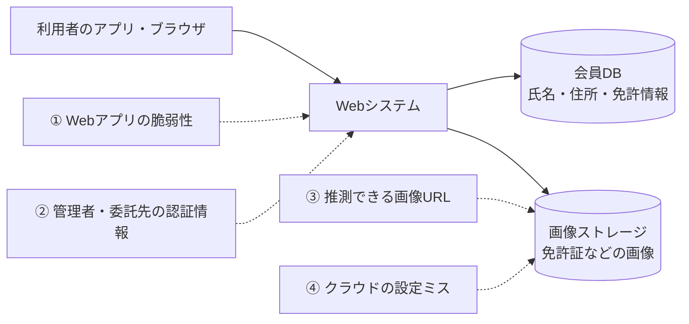

## 本記事について

カーシェア大手「タイムズカー」のWebシステムが不正アクセスを受け、退会者を含む約660万アカウントの個人情報が第三者に取得されました。うち約160万件では、運転免許証などの本人確認書類の画像まで流出しています。侵入経路は未公表ですが、技術的な論点ははっきりしています。失効できない認証素材である免許証の画像を、攻撃を受けたWebシステムに、退会後も約7年間置き続けていたことです。

この記事では、公表情報をもとに、漏れたデータを「失効できるか」で分類します。そのうえでeKYCの方式ごとの抜け道とAIによる悪用を整理し、本人確認書類の画像を持たずに済む設計と、大量持ち出しの検知をコード例つきで示します。侵入経路にかかわる部分は、公表情報がないため一般的なパターンとしての考察です。

この記事は、2026年10月3日時点の公式発表と報道をClaudeに調べてもらい、まとめたものです。本人確認の仕組みを作っている開発者や、今回の流出の対象になったかもしれない方向けです。専門用語には、身近なものに例えた説明を添えています。

## 概要

| 項目 | 内容 |
|---|---|
| 何が起きたか | タイムズカーのWebシステムへの不正アクセスで、約660万アカウントの情報が流出（9月28日公表） |
| 特に重いもの | うち約160万件で、運転免許証などの本人確認書類の画像も流出 |
| 漏れていないもの | クレジットカード情報（このシステムに保存されていなかった） |
| 侵入経路 | 未公表（10月3日時点で調査中） |
| 技術的な論点 | 失効できない画像を、攻撃を受けたWebシステムに、退会後も約7年保持していた |
| 対策の方向 | 画像の見た目に頼る本人確認をやめ、ICチップや公的個人認証で確認したら画像は捨てる |

## 構成

1. 何が起きたのか
2. 漏れたものを「失効できるか」で分ける
3. eKYCの方式ごとに見る抜け道
4. 攻撃面を整理する
5. AIは関係しているのか
6. 「画像を持たない」本人確認の設計
7. 大量の持ち出しを検知する
8. 影響を受けた人がやること
9. まとめ

## 1. 何が起きたのか

9月25日に見つかった不正アクセスで、約660万アカウントの情報が持ち出されていたことが分かりました。対象は今の会員だけではありません。退会した人、入会手続きを途中でやめた人、法人向け「タイムズビジネスサービス」の会員と退会者も含まれます。

| 日付 | 出来事 |
|---|---|
| 9月25日 9:07 | タイムズカーのWebシステムで不正アクセスを検知。同日、情報漏えいの可能性を公表（第1報） |
| 9月26日 7:25 | 侵入経路と、攻撃元との通信を遮断 |
| 9月28日 | 約660万アカウントの情報が第三者に取得されたと確認（第2報）。この時点で不正利用は確認されていないと説明 |
| 9月29日 | うち約160万件で本人確認書類の画像も漏えいしたと公表（第3報）。対象者へメールで個別の連絡を開始 |
| 9月29日〜10月2日 | 信用情報機関（CIC・JICC・KSC）に申告が殺到し、ネット受付の遅れや一時休止が続く |
| 10月1日 | 退会者向けの問い合わせフォームを開設 |

流出した情報は、範囲によって2段階に分かれます。

- **約660万アカウント**：氏名、住所、生年月日、電話番号、メールアドレス、会員番号、運転免許の情報、法人会員の部署名など、連携サービスのID（JR西日本の「WESTER ID」など9サービス）、パスワード
- **うち約160万件**：上記に加えて、運転免許証、現住所確認書類（公共料金の請求書など）、学生証（学生プラン）、家族確認書類（家族プラン）の画像

画像が漏れた人には、「ご提出いただいた本人確認書類情報が漏えいしていたことが確認されました」という個別メールが届いています。クレジットカード情報はこのシステムに保存されておらず、流出していません。パスワードは復元できない形式で保管されていたと発表されています。

## 2. 漏れたものを「失効できるか」で分ける

インシデントの重さは、漏れたものを失効・変更できるかで決まります。パスワードやAPIキーは変えれば済みますが、免許証の情報は変えられません。

例えるなら、パスワードはダイヤル錠の番号です。知られても番号を変えれば済みます。免許証の情報は指紋に近く、一度出回ると一生ついて回ります。

| 漏れたもの | 失効・変更 | 攻撃者にとっての使い道 |
|---|---|---|
| パスワード（ハッシュ値） | できる | ハッシュ方式が弱ければ総当たりで平文に戻し、使い回し先にログイン |
| メールアドレス・電話番号 | しにくい | 「タイムズカーの会員」と分かったうえでのフィッシング |
| 連携サービスのID（WESTER IDなど） | 実質できない | 複数のサービスにまたがる名寄せ |
| 免許証などの書類画像 | できない | 画像を送る本人確認や券面の目視確認の突破、偽造の型紙 |

クレジットカード情報は、このシステムに保存されていなかったため流出していません。決済を別のシステムに分けていたことが、被害を一段小さくしています。

パスワードは「復元できない形式」で保管されていたと発表されています。ただ、SHA-256のような高速なハッシュ関数だと、単純なパスワードはGPUの総当たりで割り出せます。方式（Argon2idやbcryptか）が公表されるまでは、使い回し先を変えておくのが無難です。

「復元できない形式」とは、多くの場合ハッシュのことです。ハッシュは果物をジュースにするミキサーのようなもので、ジュースから果物には戻せません。ただ、候補を片っ端からミキサーにかけて同じ味になるか比べれば、元の果物は当てられます。これが総当たりです。

Argon2idやbcryptは、わざと1回に時間とメモリがかかるように作られたミキサーです。1回なら気にならない遅さでも、何億回も試す総当たりには重すぎます。

免許証番号が変えられないのは、番号の構造によります。12桁のうち、1〜2桁目は最初に免許を受けた都道府県公安委員会、3〜4桁目はその年（西暦の下2桁）、5〜10桁目は管理番号、11桁目はチェックデジット、12桁目は紛失などによる再交付の回数です。更新しても変わらず、氏名・生年月日・顔も変えられません。

この構造は、守る側の実装にも関係します。都道府県と取得年が分かれば、未知の部分は実質6桁です。免許証番号をSHA-256などでハッシュ化して保存しても、総当たりで簡単に元の番号に戻せます。ミキサーの例えでいえば、候補の果物が100万種類ほどしかない状態で、全部かけてもコンピューターなら一瞬です（対策は後述）。家族プランの家族確認書類や学生プランの学生証も、同じく失効できない情報です。

## 3. eKYCの方式ごとに見る抜け道

オンラインの本人確認（eKYC）の方式は、犯罪収益移転防止法の施行規則で決められています。流出画像で突破されうるのは、画像の「見た目」に頼る方式です。

eKYCは、銀行や携帯ショップの窓口で免許証を見せていた本人確認を、スマホの中で済ませる仕組みです。窓口の係員の代わりに、送られてきた画像や電子データを見て判断します。

| 方式（現行の呼び名） | 送るもの | 本人と判断する根拠 | 流出画像での突破 | 2027年4月以降 |
|---|---|---|---|---|
| ホ方式 | 書類の画像＋自撮り（容貌）の画像 | 券面の見た目と、顔の一致 | 偽造画像やディープフェイクで突破されうる | 廃止 |
| ヘ方式 | 書類のICチップ情報＋自撮りの画像 | 電子署名による改ざん検知と、チップ内の顔写真との照合 | 画像だけでは不可。カード現物と暗証番号が必要 | 存続（方式の記号は変わる） |
| ワ方式（公的個人認証） | マイナンバーカードの署名用電子証明書による電子署名 | J-LISの電子証明書と失効情報 | 画像だけでは不可。カード現物とパスワードが必要 | 原則の方式に |

違いは、検証の根拠が「見た目」か「暗号」かです。ICチップの情報には発行者の電子署名が付いており、改ざんすれば検証に失敗します。運転免許証のICチップは、氏名や免許証番号を読むのに1つ目の暗証番号、顔写真や本籍を読むのに2つ目の暗証番号が必要です。公的個人認証の署名用電子証明書は、英数字6〜16桁のパスワードで守られています。

ホ方式は、免許証のカラーコピーと自撮り写真を送って、窓口の人に見比べてもらうようなものです。コピーの出来がよければ、見た目では見抜けません。ICチップの電子署名は発行元が押した割り印のようなもので、中身を1文字でも書き換えると印が合わなくなります。

公的個人認証は、カードの中に入っている実印を、その場で押してもらうようなものです。J-LISの電子証明書は印鑑証明、失効情報の確認は「その実印が今も有効か」を役所に問い合わせることにあたります。画像というコピーをいくら持っていても、実印と暗証番号がなければ押せません。

つまり、ICチップや公的個人認証を使う方式では、流出した画像だけではなりすませません。ヘ方式も自撮りの照合部分はディープフェイクの影響を受けますが、チップの情報そのものは偽れないため、攻撃者にはカード現物と暗証番号が必要になります。

### 特に危ないのは、2027年3月まで

国はいま、「免許証を撮影して送る」本人確認を、ICチップを読み取る方式へ切り替えている途中です。携帯電話のオンライン契約では、2026年4月に画像を送る方式が原則廃止されました。銀行や貸金業者などで使われてきた「ホ方式」（書類の画像と自撮りを送る方式）は、2027年4月1日に廃止されます。


*本人確認の制度変更と今回の流出の時期（公表資料と報道をもとに筆者作成）*

裏を返せば、それまでの約半年は、画像だけで本人確認が通る場面が残ります。流出した画像が最も価値を持つのは、この期間です。切り替えの後も、偽造免許証を使った対面の手続きなどでの悪用は残ります。

## 4. 攻撃面を整理する

侵入の直接の原因は、10月3日時点で公表されていません。分かっているのは、9月25日9時7分に検知し、翌26日7時25分に侵入経路を遮断したこと（約22時間）と、書類の画像が攻撃を受けたWebシステムに保存されていたことです。以下は、同じ構成のシステムで一般に考えられる経路の整理で、今回の原因を示すものではありません。



| 経路 | よくある原因 | 確認したい対策 |
|---|---|---|
| ① Webアプリの脆弱性 | SQLインジェクション、SSRF、古いライブラリ | 依存関係の更新、DBユーザーの権限を最小に |
| ② 管理者・委託先の認証情報 | パスワードの使い回し、多要素認証なし、フィッシング | 管理系はSSOと多要素認証、接続元の制限 |
| ③ 推測できる画像URL | 連番のID（IDOR）、有効期限の長い署名付きURL | オブジェクト単位の認可、署名付きURLは数分で失効 |
| ④ クラウドの設定ミス | 公開設定のバケット、強すぎるIAMロール | 設定の継続監査、Web層から画像を一覧できない権限設計 |

表の用語を、お店に例えるとこうなります。

- **SQLインジェクション**：申込用紙の名前欄に「金庫の中身を全部出せ」と書いておくと、事務員がそのまま実行してしまう欠陥です。
- **SSRF**：外からは入れない奥の部屋について、店員に「この内線にかけて、中身を読み上げて」と頼み、聞き出す手口です。
- **IDOR（連番のID）**：ホテルの部屋番号を1つ変えるだけで、隣の部屋の鍵まで開いてしまう状態です。画像のURLの番号を変えるだけで、他人の免許証画像が見えてしまいます。
- **署名付きURL**：期限付きの入館証です。期限が長いと、落とした入館証で何日も入れてしまいます。
- **バケットとIAMロール**：バケットはクラウド上の倉庫、IAMロールは社員証に付いた権限です。権限が強すぎると、受付係の社員証で金庫まで開いてしまいます。
- **多要素認証とSSO**：多要素認証は、鍵と暗証番号の二重ロックです。SSOは社内の入館証を1枚にまとめる仕組みで、発行と取り上げを1か所で管理できます。

どの経路だったとしても、被害の大きさを決めたのは侵入された後の構造です。

- **保持期間**：同社は退会後も約7年間、会員の情報を保管していました。理由は法人税法の取引記録の保存義務ですが、免許証の画像はその対象ではなく、「なりすまし対策や問い合わせへの備え」として残していました。画像の保持期間を取引記録と分けていなかったため、退会者や入会手続きを途中でやめた人まで対象になりました。
- **配置**：書類の画像が、攻撃を受けたWebシステムに保存されていました。Web層の権限で画像を大量に読めるなら、Web層の侵害がそのまま画像の大量流出になります。
- **価値**：画像だけで本人確認が通る場面があるため、本人確認書類の画像はそれ自体が売り物になります。

お店に例えるなら、Web層はお客さんと直接やりとりする売り場です。売り場の店員が倉庫のすべての棚を開けられる作りだと、店員が一人だまされただけで、在庫が丸ごと持ち出されます。

### まだ分かっていないこと

- 侵入された経路と、使われた手口
- 侵入が始まった時期（いつから情報を抜かれていたか）
- 保存されていた画像が暗号化されていたか、暗号化の鍵はどこにあったか
- 流出したデータが売買・公開されているか

## 5. AIは関係しているのか

今回の侵入にAIが使われたかどうかは分かっていません。手口は公表されておらず、AIの関与を示す情報も出ていません（10月3日時点）。ただ、AIは「侵入」と「悪用」の両方で、攻撃側のコストを下げています。

### 侵入側：自律型AIエージェントによる攻撃

AIエージェントが侵入作業の大半を自律的にこなした攻撃は、すでに報告されています。[Anthropicの報告](https://www.anthropic.com/news/disrupting-AI-espionage)（2025年11月）によると、中国の国家支援とみられる集団が「Claude Code」を使い、約30の組織を狙いました。偵察、脆弱性の探索、エクスプロイトの作成、認証情報の窃取、横展開、データの持ち出しまで、作業の8〜9割をAIが実行し、人間は要所の判断だけをしていました。

AIエージェントは、指示を受けて「調べる・試す・直す」を自分で繰り返すAIです。泥棒に例えるなら、下見から鍵開け、運び出しまでを一人でこなし、疲れも眠りもしない助手を雇ったようなものです。エクスプロイトは見つけた弱点を突くための道具、横展開は一度入った部屋から廊下を伝って隣の部屋に入っていくことです。

守る側にとっての意味は、脆弱性が見つかってから悪用されるまでの時間が縮むことです。パッチ適用の速さ、外部から見える資産の把握、検知と遮断の自動化が、これまで以上に効いてきます。IPAの[「情報セキュリティ10大脅威 2026」](https://www.ipa.go.jp/pressrelease/2025/press20260129.html)でも、「AIの利用をめぐるサイバーリスク」が組織向けの3位に初めて入りました。9月下旬に企業の被害公表が相次いだ背景にAIがあると見る[識者もいます](https://www.tokyo-sports.co.jp/articles/-/404951)。

### 悪用側：画像ベースのeKYCを突く技術

流出した画像を本人確認の突破に使う場合、攻撃は次の流れになります。

1. **素材**：流出した免許証の画像（券面と顔写真）
2. **生成**：顔の差し替え（face swap）で、顔写真に似せた自撮り映像を作る。券面の文字や写真を書き換える
3. **注入**：仮想カメラ、改ざんしたアプリ、エミュレーターで、カメラの入力を合成映像に置き換える
4. **突破**：ライブネス検知（生きた人間かの判定）と顔照合を通過する

顔の差し替え（face swap）は、映像の中の人にデジタルのお面をリアルタイムでかぶせる技術です。仮想カメラは、アプリに「これがカメラの映像です」と偽の映像を渡すソフトです。エミュレーターは、パソコンの中で動く作り物のスマホです。

3の注入は「インジェクション攻撃」と呼ばれ、カメラの前に写真やマスクをかざす「プレゼンテーション攻撃」とは区別されます。プレゼンテーション攻撃の検知（PAD）はISO/IEC 30107で、インジェクション攻撃の検知は2024年に欧州標準化委員会が承認した[CEN/TS 18099](https://withpersona.com/blog/what-is-cen-ts-18099-a-guide-to-the-injection-attack-detection-standard)で扱われます。CEN/TS 18099は、注入の手段（仮想カメラなど）と、注入される素材（ディープフェイク映像や合成した顔など）を分けて扱います。

防犯カメラに例えると、プレゼンテーション攻撃はカメラの前にお面をかぶって立つことです。インジェクション攻撃は、カメラのケーブルを抜いて、録画済みのビデオをつなぐことにあたります。カメラの前には誰も立っていないので、お面を見破る仕組みでは気づけません。

ライブネス検知は、「まばたきしてください」「右を向いてください」と頼んで、写真ではなく生きた人間かを確かめる仕組みです。CEN/TS 18099は、ケーブルの差し替えを見抜けるかを試すための、いわば車検の基準です。

防御は、層を分けて考えます。

| 層 | 対策の例 |
|---|---|
| 端末 | アプリの改ざん、エミュレーター、root化の検知（Play Integrity API、App Attest） |
| 入力 | 仮想カメラやカメラAPIの差し替えの検知、インジェクション攻撃の検知（IAD） |
| 照合 | ランダムな動作を指示する能動的なライブネス検知、PAD |
| 方式 | ICチップの読み取りや公的個人認証に切り替え、画像の見た目に頼らない |

Play Integrity APIとApp Attestは、アプリやスマホが改造されていないことを、GoogleやAppleに証明してもらう仕組みです。いわば「改造車ではない」という証明書です。root化は、スマホのメーカーがかけている制限を外す改造のことです。

端末・入力・照合の層はいたちごっこになりがちです。根本的に効くのは、最後の「方式」の層です。

### 実際に起きていること

- **研究**：日立製作所は、公開されているディープフェイクのソフトでリアルタイムに顔を差し替え、模擬的な本人確認アプリで別人の免許証を使うなりすましを試す実験を報告しています（[日経クロステック](https://xtech.nikkei.com/atcl/nxt/column/18/01760/083000004/)）。
- **偽造**：1枚15ドルで26か国の身分証の画像を作るサイト「OnlyFake」の画像で、米メディアの404 Mediaが暗号資産取引所の本人確認を通過したと報じました（[Cointelegraph](https://cointelegraph.com/news/ai-generated-fake-ids-pass-crypto-exchange-kyc-onlyfake)）。本当に生成AIを使っていたかは、専門家が疑問視しています。
- **国内**：JICCは2024年4月、偽造書類を使ったスマホアプリからの申し込みに16件の信用情報を開示していたと[公表](https://www.jicc.co.jp/aboutus/news/a075i00000OwTm8AAF)しました。CICでも2025年4月にネット開示でなりすましが起き、36人分の情報が第三者に見られた可能性があります。CICは同年10月、マイナンバーカードでの本人確認を必須にしてネット開示を[再開](https://www.watch.impress.co.jp/docs/news/2049263.html)しました。

ホ方式の廃止の背景にも、画像編集や生成AIで書類や顔の偽造が容易になったことがあると指摘されています（[TRUSTDOCK](https://biz.trustdock.io/column/ic-chip-ekyc)）。流出した氏名や住所を差し込んだ自然な日本語の詐欺メールも、生成AIなら大量に作れます。

## 6. 「画像を持たない」本人確認の設計

方針は「確認したら、結果だけを残す」です。

1. クライアントで免許証やマイナンバーカードのICチップを読むか、公的個人認証で電子署名する
2. サーバーで、電子署名と証明書の有効性を検証する
3. 検証の結果だけを保存し、画像やチップの生データは捨てる

保存するレコードは、たとえば次の形です。

```ts
import { createHmac } from "node:crypto";

// 保存するのは「確認した事実」だけ。画像やICチップの生データは持たない
type IdentityVerification = {
  userId: string;
  method: "jpki_signature" | "ic_chip_with_face";
  verifiedAt: string; // ISO 8601
  documentExpiresOn?: string; // 免許証の有効期限。再確認の予定に使う
  documentNumberDigest: string; // 重複登録の検知用。番号そのものは保存しない
};

// 免許証番号は未知の部分が実質6桁しかなく、鍵なしのハッシュは総当たりで戻せる。
// 秘密鍵つきのHMACにし、鍵はDBとは別のKMSやHSMで管理する
export function digestDocumentNumber(documentNumber: string, key: Buffer): string {
  const digits = documentNumber.normalize("NFKC").replace(/\D/g, "");
  return createHmac("sha256", key).update(digits).digest("hex");
}
```

ミキサーの例えでいえば、HMACは秘密のスパイスを入れてからミキサーにかける方法です。スパイスの配合を知らない人は同じジュースを作れないので、片っ端から試すこともできません。

HMACの鍵がDBと一緒に漏れれば、総当たりはまた可能になります。鍵をアプリのメモリに載せず、KMSのHMAC機能（AWS KMSのGenerateMacなど）で計算すれば、DBだけが漏れても番号には戻せません。ただしアプリの権限を奪われるとKMSを総当たりに使われる余地が残るので、呼び出し回数も監視します。

KMSは、このスパイスを預かり、頼まれたときだけ代わりに混ぜてくれる金庫番のようなサービスで、HSMはその金庫そのものにあたります。スパイスは金庫の外に出ないので、レシピ帳（DB）を盗んだだけでは同じ味を再現できません。

目視の審査などで、どうしても画像を持つ場合は、次のように分けて守ります。

- 画像は審査用の別ストレージ（別アカウント）に置き、Web層から直接読めない構成にする
- オブジェクトごとのデータキーで暗号化し（エンベロープ暗号化）、復号の権限は審査系だけに付ける
- 署名付きURLは数分で失効させ、一覧取得（ListBucket）の権限は与えない
- 審査が終わったら自動で消す。S3ならライフサイクルルールで期限を切れる

```json
{
  "Rules": [
    {
      "ID": "expire-kyc-review-images",
      "Filter": { "Prefix": "kyc-review/" },
      "Status": "Enabled",
      "Expiration": { "Days": 7 }
    }
  ]
}
```

エンベロープ暗号化は、書類を小さな金庫に入れ、その金庫の鍵をさらに大きな金庫（KMS）に預ける二重の仕組みです。一覧取得の権限は倉庫の棚の目録で、これがなければ侵入者はどこに何があるかを1つずつ当てるしかありません。ライフサイクルルールは、保存期限が来たら自動でシュレッダーにかける設定です。

公表内容から見える設計上のポイントは、ほかに3つあります。

- **保存期間を分ける**：法令で保存が必要な取引記録と、本人確認の画像は別のデータとして扱い、退会時には画像を消す
- **パスワード**：Argon2idかbcryptを使う。OWASPが示すArgon2idの最低ラインは、メモリ19MiB・反復2回・並列度1
- **ID連携**：連携先ごとに別の識別子を払い出すOpenID Connectのpairwise方式にすると、漏れても名寄せに使われにくい

pairwise方式は、お店ごとに別々の会員番号を発行するようなものです。共通の会員番号だと、2つのお店の名簿が漏れたときに同じ人を突き合わせられます。これが名寄せで、お店ごとに番号が違えば突き合わせの手がかりになりません。

## 7. 大量の持ち出しを検知する

侵入を完全には防げない前提で、持ち出しに早く気づく仕組みを用意します。

- **量で気づく**：仮に画像1枚を1MBとすると、160万枚で約1.6TBです。普段の通信と比べれば目立つ量です。IAMロールやサービスアカウントなど主体ごとに、読み出しの件数と量を監視し、オブジェクト単位のアクセスログ（S3のデータイベントなど）を残します。
- **おとりで気づく**：本物に見えるダミーの会員レコードや画像（ハニートークン）を混ぜ、読み出されたら通知します。ダミーのメールアドレスも混ぜておけば、そこに届く詐欺メールで、データが外で使われ始めたことにも気づけます。
- **速さで負けない**：AIで攻撃が速くなる前提で、しきい値を超えたら認証情報を無効にするなど、遮断までを自動化します。

1.6TBは、容量128GBのスマホに写真をぎっしり詰めたときの十数台分です。オブジェクト単位のアクセスログは、倉庫の入退室記録を、箱1つごとに取るようなものです。ハニートークンは、わざと置いておくおとりの財布で、中身はダミーでも、手を付けられたら侵入の証拠になります。

## 8. 影響を受けた人がやること

1. 「タイムズカー」を名乗るメールやSMSのリンクを開かない。同社は、メール・SMS・電話でパスワードやクレジットカード情報を聞くことはないと案内しています。
2. 対象か確かめる。会員向けの窓口は 0120-25-8924（24時間）です。退会した人は、公式の[第3報ページ](https://share.timescar.jp/news/2026/0929/1816.html)のフォームから確認できます。
3. 画像が漏れていたら、信用情報機関3か所に「本人申告」を出す。米国のクレジットフリーズのように申し込みを止める仕組みではなく、審査する会社に注意を促す登録です（最長5年）。
4. 使い回しているパスワードを変え、数か月おきに信用情報を開示して、身に覚えのない申し込みや契約がないか確かめる。

| 機関 | 主な加盟先 | 申込方法と手数料 | 10月3日時点の状況 |
|---|---|---|---|
| [CIC](https://www.cic.co.jp/mydata/declaration/mailing.html) | クレジットカード会社・信販会社など | ネット・郵送（手数料は公式サイトで確認） | 9月29日から手続きの遅れを案内 |
| [JICC（日本信用情報機構）](https://www.jicc.co.jp/comment/01) | 消費者金融など | スマホアプリ 700円、郵送 1,000円 | 10月1日にアプリ受付を一時休止、2日に再開。つながりにくい状態が続く |
| [KSC（全国銀行個人信用情報センター）](https://www.zenginkyo.or.jp/pcic/return/) | 銀行・信用金庫など | Web 500円、郵送 | 9月29日にWeb受付を一時休止、30日に再開 |

## 9. まとめ

- 免許証の画像は、パスワードと違って失効できない認証素材です。どう守るかより先に、持たない設計を考えるべきデータです。
- 画像の見た目に頼るeKYCは、流出画像とAIの組み合わせで突破されうる方式です。ホ方式が廃止される2027年4月までは、特に悪用されやすい期間が続きます。
- どうしても持つなら、保持期間を短くし、Web層から切り離し、読み出しの量で異常に気づける構成にします。

今後は、原因調査の結果（侵入経路と、侵入が始まった時期）の公表と、一人ひとりへの漏えい内容の案内（10月中旬めど）、補償方針の決定が予定されています。侵入経路が分かれば、この記事の「攻撃面を整理する」で挙げた仮説の答え合わせができます。

## 参考資料

**公式発表と報道**

- [タイムズカー「不正アクセスによる個人情報漏えいの可能性について（第1報）」](https://share.timescar.jp/news/2026/0925/1814.html)
- [タイムズカー「不正アクセスに関する調査結果および今後の対応について（第2報）」](https://share.timescar.jp/news/2026/0928/1815.html)
- [タイムズカー「不正アクセスに関する調査結果および今後の対応について（第3報）」](https://share.timescar.jp/news/2026/0929/1816.html)
- [タイムズモビリティ「タイムズカーWebサイトへの不正アクセスに関しよくあるご質問」（PDF）](https://corp.timescar.jp/mail/announce/faq.pdf)
- [パーク24「タイムズカーWebシステムへの不正アクセスに関する調査結果および今後の対応について（第2報）」](https://www.park24.co.jp/news/2026/09/20260928-1.html)
- [JR西日本 WESTER「タイムズカーWebサイトへの不正アクセスについて（続報）」](https://wester.jr-odekake.net/news/detail/022026092901/)
- [日本経済新聞「タイムズカー、個人情報最大660万件流出 不正アクセスで免許証画像も」](https://www.nikkei.com/article/DGXZQOUC284OR0Y6A920C2000000/)
- [ITmedia NEWS「タイムズカー、退会者の免許証画像も『7年』保存していた理由 パーク24に聞いた」](https://www.itmedia.co.jp/news/article/2609/30/2000001877/)
- [ITmedia NEWS「免許証の悪用防ぐ届出集中、CIC・JICCで手続き遅延」](https://www.itmedia.co.jp/news/article/2609/30/2000001873/)
- [ITmedia NEWS「免許悪用防止届出 JICCのアプリ受付再開も、つながりにくい状態続く」](https://www.itmedia.co.jp/news/article/2610/02/2000001959/)
- [ITmedia NEWS「タイムズカー漏えいで集団訴訟の動き、登録3000人弱」](https://www.itmedia.co.jp/news/article/2610/02/2000001962/)
- [日テレNEWS「「タイムズカー」免許証画像など約160万件が流出 専門家『借金されてしまうのが一番大きなリスクに』」](https://news.yahoo.co.jp/articles/3a944783bbf351a7fa8e7d6cf7e039d04dd2f03d)
- [ピンズバNEWS「タイムズカー情報漏えいで『消費者金融の借入』『トクリュウに悪用』も」](https://news.yahoo.co.jp/articles/8498c760e4af346e7e03ef4f577c970e718e74ac)
- [日刊自動車新聞「パーク24、情報漏えいで退会者向け問い合わせフォーム開設」](https://www.netdenjd.com/archives/700162)
- [全国銀行個人信用情報センター「本人申告の手続き」](https://www.zenginkyo.or.jp/pcic/return/)
- [JICC「本人申告コメントを申し込む」](https://www.jicc.co.jp/comment/01)
- [CIC「郵送で本人申告する」](https://www.cic.co.jp/mydata/declaration/mailing.html)
- [CIO「犯収法施行規則改正で本人確認の何が変わるのか」](https://www.cio.com/article/4035461/%E7%8A%AF%E5%8F%8E%E6%B3%95%E6%96%BD%E8%A1%8C%E8%A6%8F%E5%89%87%E6%94%B9%E6%AD%A3%E3%81%A7%E6%9C%AC%E4%BA%BA%E7%A2%BA%E8%AA%8D%E3%81%AE%E4%BD%95%E3%81%8C%E5%A4%89%E3%82%8F%E3%82%8B%E3%81%AE%E3%81%8B.html)
- [総務省：携帯電話不正利用防止法施行規則の改正案に対する意見募集](https://www.soumu.go.jp/menu_news/s-news/01kiban18_01000276.html)
- [Selectra：携帯電話契約の本人確認の変更について](https://selectra.jp/telecom/news/mobile-contract-mynumber-id-verification-2026)

**AIに関する節**

- [Anthropic「Disrupting the first reported AI-orchestrated cyber espionage campaign」](https://www.anthropic.com/news/disrupting-AI-espionage)
- [IPA「情報セキュリティ10大脅威 2026」](https://www.ipa.go.jp/pressrelease/2025/press20260129.html)
- [東スポWEB「タイムズカーだけではない！ ＡＩ主導の不正アクセス事件頻発の背景と最悪シナリオ」](https://www.tokyo-sports.co.jp/articles/-/404951)
- [日経クロステック「eKYCの身元確認をディープフェイクで突破？分野横断ルール作りへデジタル庁の重責」](https://xtech.nikkei.com/atcl/nxt/column/18/01760/083000004/)
- [CyberLink：インジェクション攻撃検知（IAD）の解説](https://jp.cyberlink.com/faceme/insights/articles/2067/what-is-IAD)
- [Cointelegraph：OnlyFakeの偽造IDが本人確認を通過したとする報道](https://cointelegraph.com/news/ai-generated-fake-ids-pass-crypto-exchange-kyc-onlyfake)
- [JICC「第三者への信用情報開示についてのお詫びとお知らせ」](https://www.jicc.co.jp/aboutus/news/a075i00000OwTm8AAF)
- [Impress Watch「CIC、10月9日からインターネット開示再開 マイナカードの本人確認必須化」](https://www.watch.impress.co.jp/docs/news/2049263.html)
- [TRUSTDOCK「ホ方式廃止に伴い、eKYCは「ICチップ読取」の時代へ」](https://biz.trustdock.io/column/ic-chip-ekyc)

**技術的な節**

- [TMI総合法律事務所「犯罪収益移転防止法施行規則の改正による本人確認方法の厳格化について」](https://www.tmi.gr.jp/eyes/blog/2026/18168.html)
- [保科秀之「【2027年4月】犯収法で本人確認はこう変わる｜IC中心6類型と確認記録の実務」](https://note.com/hoshina_ekyc/n/nd297805e1d52)
- [ネクスウェイ：ICチップの電子署名検証による本人確認（ヘ方式）に関するニュースリリース（PDF）](https://www.nexway.co.jp/wp-content/uploads/2022/08/20220818_News-Release.pdf)
- [乗りものニュース：運転免許証のICチップと暗証番号](https://trafficnews.jp/post/127663)
- [くるまのニュース：運転免許証の12桁の番号の意味](https://kuruma-news.jp/post/660653)
- [板橋区：公的個人認証サービスの電子証明書と暗証番号](https://www.city.itabashi.tokyo.jp/tetsuduki/koseki/mynumber/1048800/1020951.html)
- [Persona「What is CEN/TS 18099? A guide to the injection attack detection standard」](https://withpersona.com/blog/what-is-cen-ts-18099-a-guide-to-the-injection-attack-detection-standard)
- [OWASP Password Storage Cheat Sheet](https://cheatsheetseries.owasp.org/cheatsheets/Password_Storage_Cheat_Sheet.html)
- [OpenID Connect Core 1.0（Subject Identifier Types）](https://openid.net/specs/openid-connect-core-1_0.html)
